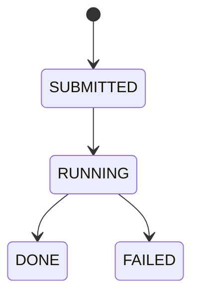
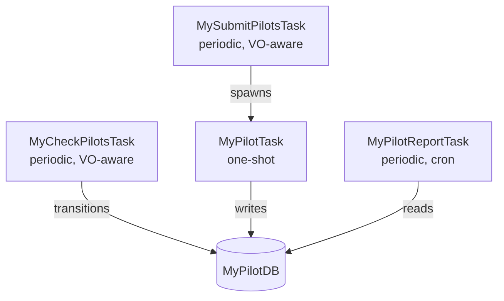

# Part 1: Design

Before writing code, think about the domain and make design decisions.

## Identify entities

Our system has two main entities:

| Entity                   | Description                                                             |
| ------------------------ | ----------------------------------------------------------------------- |
| **Compute Element (CE)** | A site where pilots can be submitted. Has a capacity and reliability.   |
| **Pilot Submission**     | A record of a pilot sent to a CE. Transitions through lifecycle states. |

## State machine

Pilots follow this lifecycle:

## Task graph

We need four tasks:

| Task                 | Type                    | Schedule      | Purpose                                            |
| -------------------- | ----------------------- | ------------- | -------------------------------------------------- |
| `MySubmitPilotsTask` | PeriodicVoAwareBaseTask | Every 60s     | Finds available CEs, spawns `MyPilotTask` per slot |
| `MyPilotTask`        | BaseTask (one-shot)     | On demand     | Submits a single pilot to a CE                     |
| `MyCheckPilotsTask`  | PeriodicVoAwareBaseTask | Every 30s     | Transitions pilot states                           |
| `MyPilotReportTask`  | PeriodicBaseTask        | Hourly (cron) | Logs aggregate statistics                          |

## Locking strategy

- **`MyPilotTask`**: `MutexLock(MY_PILOT, ce_name)` — serialise submissions to the same CE
- **`MySubmitPilotsTask`**: default VO-scoped mutex — each VO submits independently
- **`MyCheckPilotsTask`**: default VO-scoped mutex — each VO checks independently
- **`MyPilotReportTask`**: default class-level mutex — only one report at a time

## Retry policy

`MyPilotTask` uses `NoRetry()`. Why? Because the periodic parent
(`MySubmitPilotsTask`) will naturally re-evaluate available CEs on the
next cycle and resubmit. Explicit retries would add complexity without
benefit here.

Failed tasks are dead-letter-queue eligible (`dlq_eligible = True`),
so we can inspect failures after the fact.

## What's next

With the design in hand, we'll start implementing. The order is:
database → tasks → router → tests.
